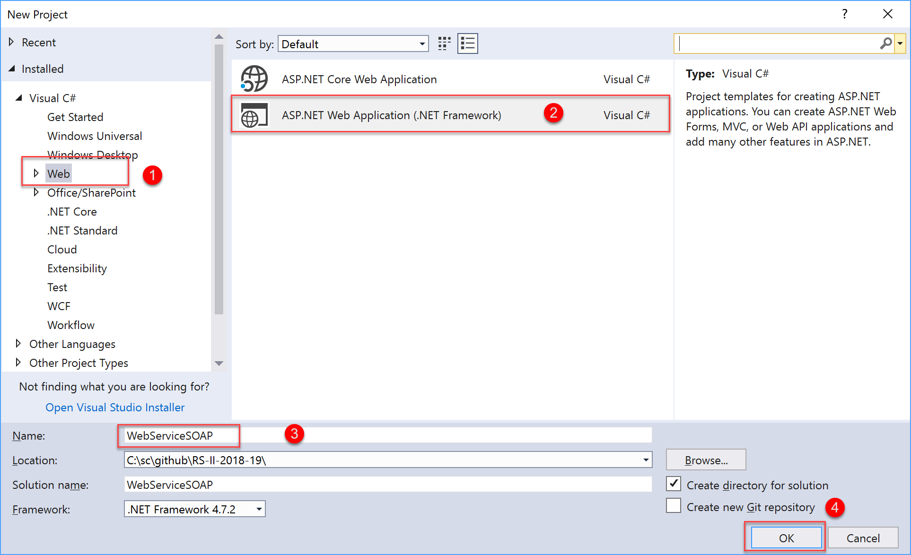
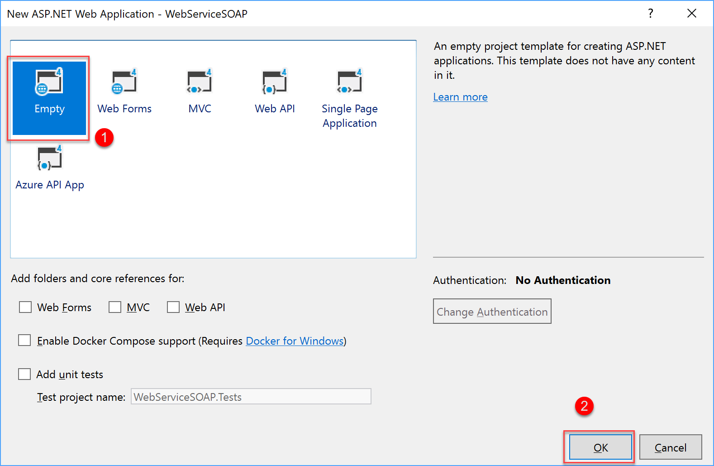
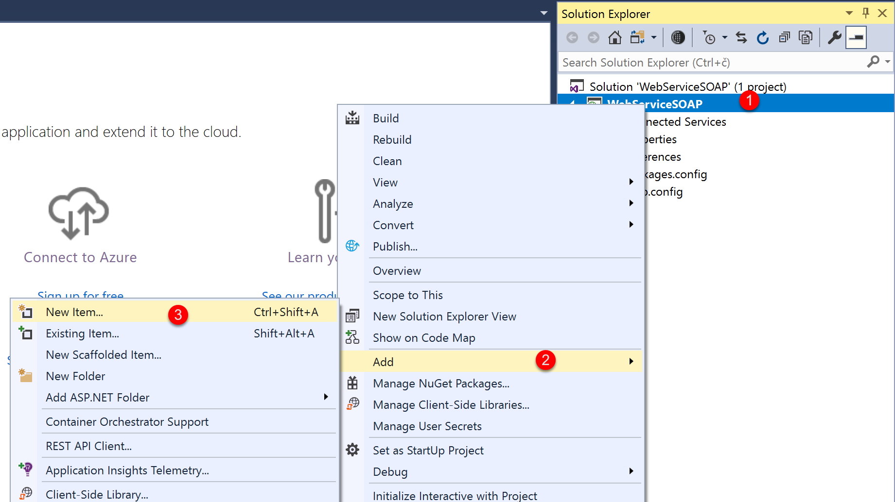
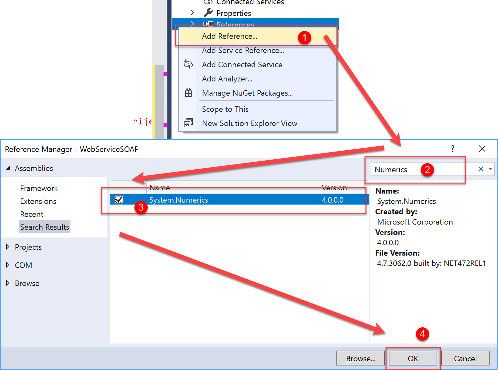
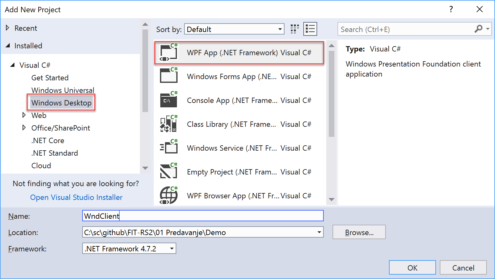
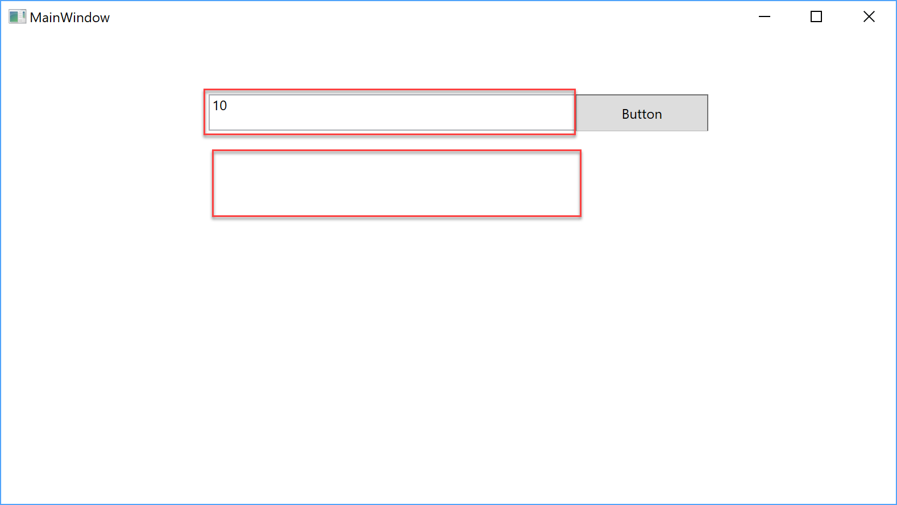
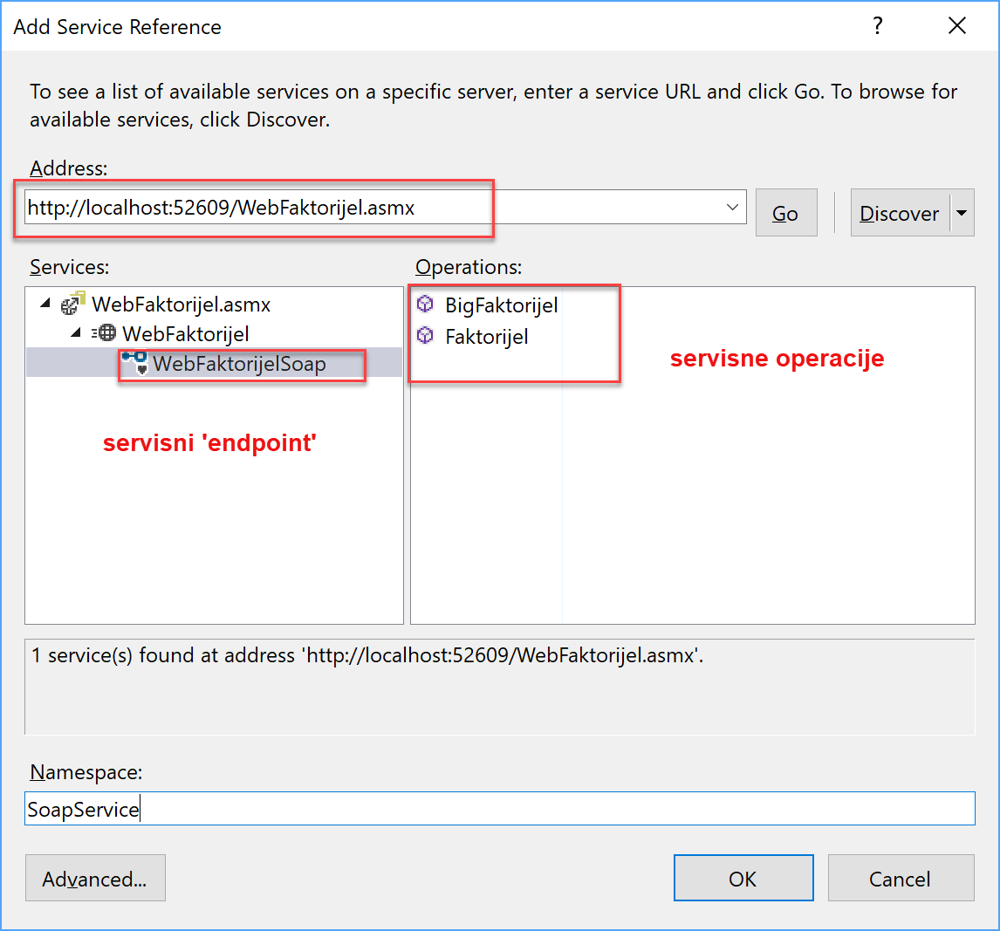

# Implementacija SOAP Web Servisa

Primjer predstavlja implementaciju SOAP Web Servisa pomoću APS.NET.
Primjer prikazije jednostavnu implementaciju dvije servise operacije za 
računanje faktorijela prirodnog broja.

## Implementacija primjera
- Pokrenuti `Visual Studio 2019`
- Unutar VS2019 odabrati: `File->New-> Project`
- Unutar Novog Dijaloga odabrati: `Web->ASP.NET Application`

- Naziv Projekta `WebServiceSOAP`
- Na sljedećem Dialogu uzeti defaultne vrijednosti:

- Kada je projekat formiran dodati SOAP Servis preko `asmx` datoteke:

 
- Dodati referencu `System.Numeric`

-Implementirati dvije servise operacije:
    1. `long Faktorijel(int)`
    2. `string BigFaktorijel(int n)`
-`F5` za pokretanje servisa u Debug modu.


## Implementacija WPF Klijenta
- Desni klik na `Solution 'WebServiceSOAP'`
- Add New Project
- Odabrati `Windows -> Desktop "WPF Application"`



- U novoformirani WPF klijent implementirati:
  - Dvije `TextBox` kontrole
  - `Button` kontrolu. 



## Uključivanje SOAP Servisa u klijenta kao Servisnu referencu

SOAP Servisi se u klijenta uključuju kao servisne reference, 
preko `Service Reference` alata unutar Visual Studia.
- Desni klik na WndClient projekat `References -> Add Service References` 

- U address unesemo adresu servisa, i kliknemo Ok.
- U `app.config` datoteci gnerirane su osnove informacije (ABC infomacije) o dodanom servisu koje nam služe 
- da bi uspjesno pozvali servisnu operaciju.
- - Implementirati dogadjaj za pozivanje servisne operacije.


````
private void Button_Click(object sender, RoutedEventArgs e)
{
    var fac = int.Parse(factoriel.Text);
    var cl = new SoapSvc.Faktorijel.WebFaktorijelSoapClient();
            
    var retValue  = cl.BigFaktorijel(fac);
    result.Text = retValue.ToString();
}
````