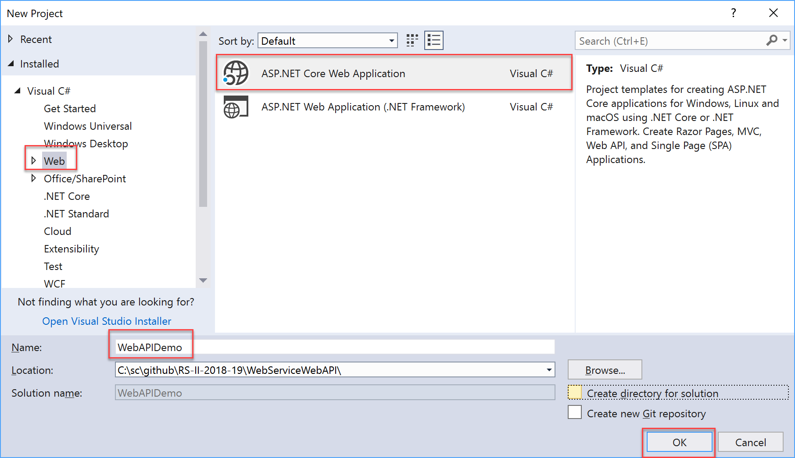
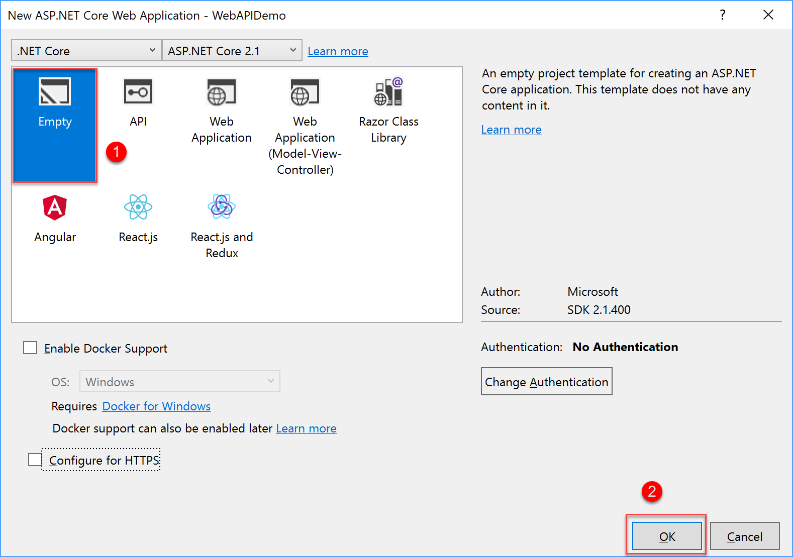
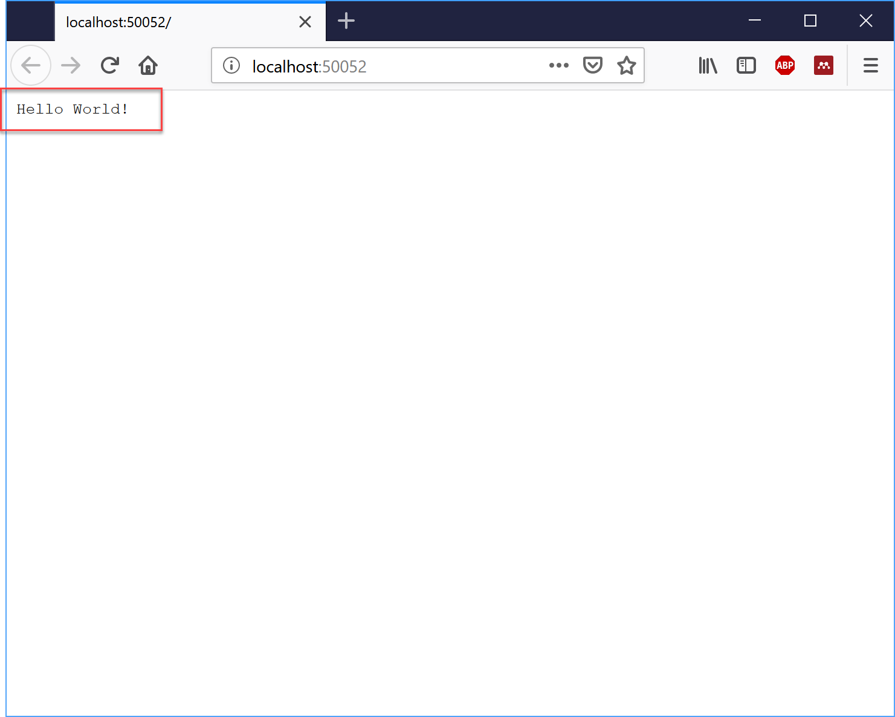
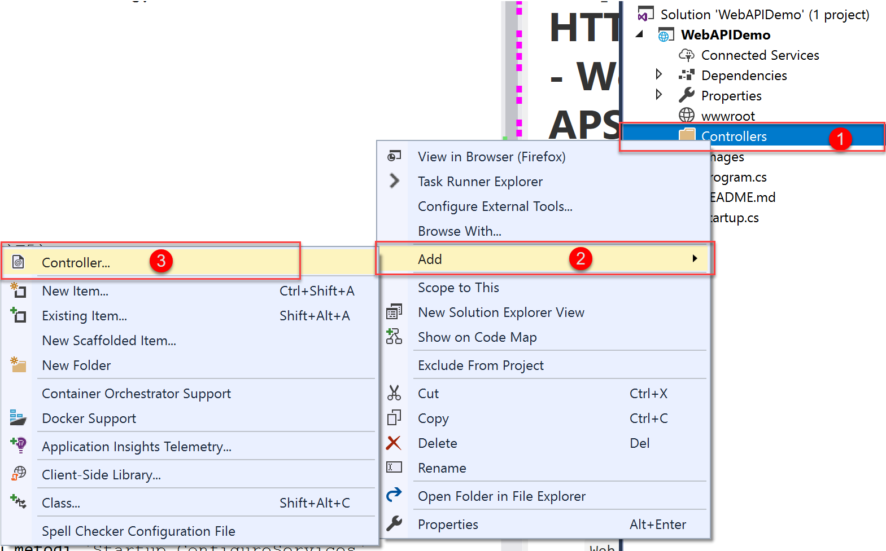
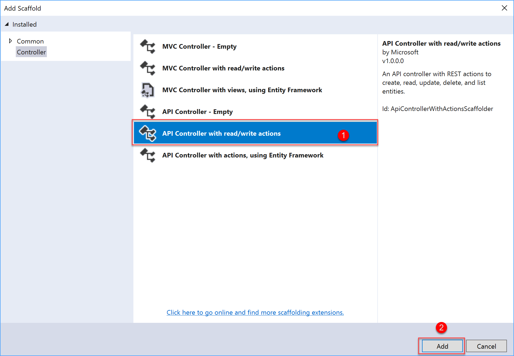
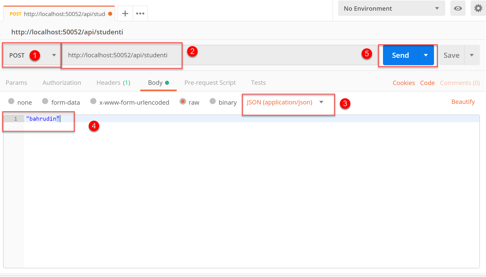
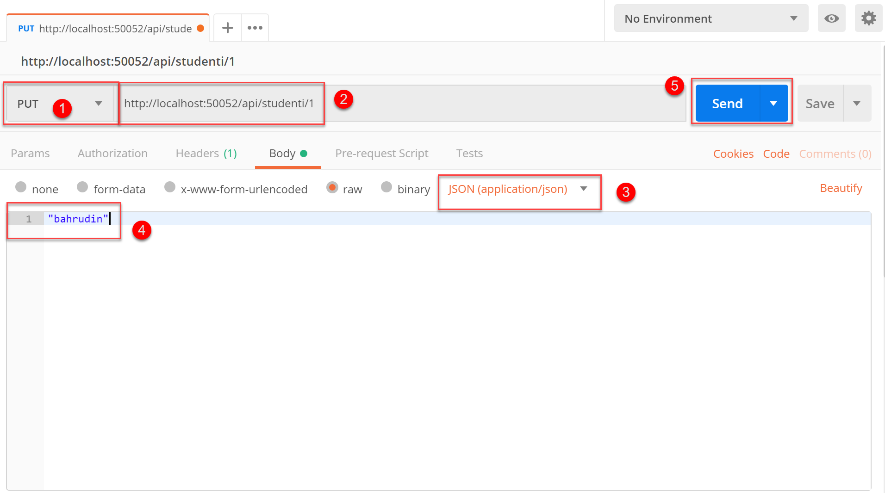
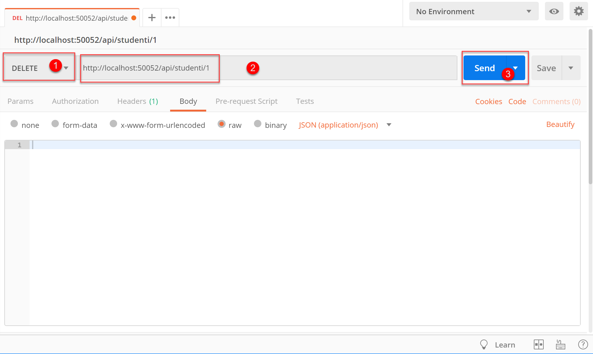

# Implementacija HTTP Web Servisa - Web API sa APS.NET Core 

Primjer predstavlja implementaciju HTTP Web Servisa pomoću ASP.NET Core.
Primjer prikazije implementaciju jednostavnog kontrollera koji sadrži metoda za manipulaciju sa podacima.

## Implementacija primjera
- Pokrenuti `Visual Studio 2019`
- Unutar VS2019 odabrati: `File->New-> Project`
- Unutar Novog Dijaloga odabrati: `Web->ASP.NET Core Application`

- Naziv Projekta `WebAPIDemo`
- Na sljedećem Dialogu uzeti isključiti opciju za HTTPS protokol:

- Kada je projekat formiran pokrenuti servis preko tipke `F5`.
- Kao rezultat u Internet browseru bi se trebao pojaviti text: `Hello World!` 

## `Pipeline` Arhitektura ASP.NET Core aplikacije 

Arhitektura APS.NET Core aplikacije bazirana je na tzv. `pipline` principu. 
Empty aplikacija koja je formirana ne sadrži nikakve implementacije, pa je potrebno dodati komponente.

## Dodavanje podrške za MVC
Prva komponenta koja se dodaje jeste podrška za MVC pattern.

Svaka komponenta u ASP.NET Core aplikaciji se prvo doda u metodi `Startup.ConfigureServices`
a ukljućuje u metodi `Startup.Configure` 

## Dodavanje Web API 

Web API dodajemo implementacijom `Kontrolera` klase koji je izved iz `BaseController`. Po standardizaciji,
 sve kontroler klase moraju biti smještene u `Controller` folder unutar projekta.
- Napraviti folder `Controllers` unutart projekta.
- Desni klik na Controllers folder i odabrati `Controllers` opciju. 
  
- Zatim odabrati opciju `API Controller with read/write options`. 
 
Upozorenje: Naziv `Controller` je standardno ime i potrebno ga je koristiti kao englesku riječ jer 
se na osnovu te riječi generator koda generise sve potrebne metode.

- Podesiti ime kontrollera na `StudentiController`.
- Unutar folder Controller otvoriti novoformiranu datoteku: `StudentiController.cs`
- Kod generator nam je generirao klasu StudentiController sa 5 metoda koje odgovaraju standardnim REST naredbama:

  - GET
  - GET by ID
  - PUT
  - POST
  - DELETE

## Testiranje GET i GET by ID zahtjeva

- Pokrenuti Web API, i testirati na način da ukucate:
      - `http://localhost:50052/api/studenti`
      - `http://localhost:50052/api/studenti/1`

- Oba zahtjeva predstavljaju GET zahtjeve koji čitaju 
- podatke sa servera i vracaju ih klijentu.

## Testiranje POST, PUT i DELETE zahtjeva

- Ove zahtjeve nije moguće testirati i pokretatu preko Internet browsera, po je potrebno koristiti pogodan alat.
- U tu svrhu koristit će se `Postman` aplikacija koje se može skinuti sa: https://www.getpostman.com/downloads/.

### Testiranje POST zahtjeva

- Post zahtjev prosljedjujemo ako odaberemo POST zahtjev, u url stavimo `http://localhost:50052/api/studenti`
- U body je potrebno staviti ime studenti kojeg prosljedjujemo serveru.
 

### Testiranje PUT zahtjeva
- Put zahtjev prosljedjujemo kad modificiramo neku informaciju na serveru. Tako da pored stringa potrebno je 
prosljediti i `Id` kao ključ toh objekta.
 

### Testiranje DELETE zahtjeva

- DELETE zahtjev brise odrešeni objekat sa servera. U tom slučaju potrebno je prosljediti Id studenta koji se briše.
 

- 
 

