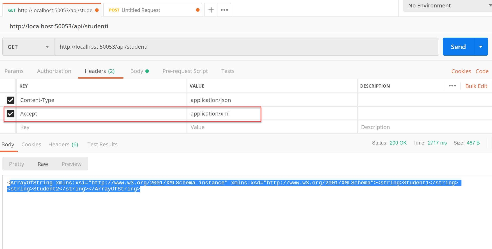

XML Content Negotiation - Web API sa APS.NET Core
=================================================

Primjer predstavlja implementaciju XML podrške za content negotiation. S obzirom
da ASP.NET Core Web API dolazi samo sa JSON podrškom za XML forma je potrebno
posebna implementacija.

Koraci pri implementaciji XML podrške za formatiranje objekata
--------------------------------------------------------------

Da bi se implementirala podrška za XML formatter potrebno je dodati unutar MVC
modula implmentirati podršku za XML:

-   Dodati `XmlSerializerFormatters` u MVC konfiguraciju Startup.cs:

~~~~~~~~~~~~~~~~~~~~~~~~~~~~~~~~~~~~~~~~~~~~~~~~~~~~~~~~~~~~~~~~~~~~~~~~~~~~~~~~
services.AddMvc(config=>
    {
        // Add XML Content Negotiation
        config.RespectBrowserAcceptHeader = true;
        //uključivanje xml formata za request
        config.InputFormatters.Add(new XmlSerializerInputFormatter(true));
        //ukljucivanje xml formata za response
        config.OutputFormatters.Add(new XmlSerializerOutputFormatter());
    }    
    );
~~~~~~~~~~~~~~~~~~~~~~~~~~~~~~~~~~~~~~~~~~~~~~~~~~~~~~~~~~~~~~~~~~~~~~~~~~~~~~~~

-   Pokrenuti Internet browser i testirati da li se resultati vraćaju u XML
    formatu.

-   Ako se pogleda Raw GET vidi se da je zahtjev poslan sa \``Accept:
    application/xml` headerom.

-   Response pokazuje da je `Content-Type: application/xml`

-   Vraćeni rezultat se formatiran u XML.

Atributom ` [Produces("application/json")]` možemo posebno za svaku akciju odrediti formatter.

Da bi rezultate testirali, u Postman aplikaciji dodajemo novi parameter `Accept=application/xml`

BSON Formatter
==============

-   BSON predstavlja binarnu verziju JSON formattera. -Na isti način moguće je
    uključiti BSON formatter podršku.

-   U `ConfigureServices` metodi dodati sljedeći kod:

-   public void ConfigureServices(IServiceCollection services)  
    {  
    services.AddMvc()  
    .AddBsonSerializerFormatters();  
    }
