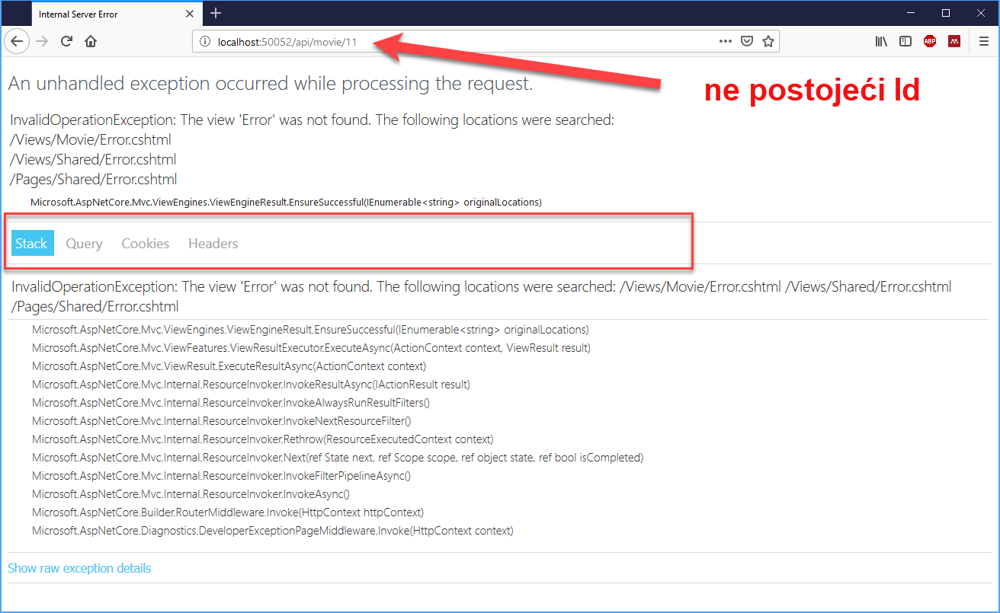

# Upravljanje izuzecima  - Web API sa APS.NET Core 

Upravljanje izuzecima u svakom softverskom rješenju predstavlja vrlo važnu komponentu. 
U ovom primjeru vidjećemo kako se upravlja sa izuzecima u ASP.NET Core Web API. Treći primjer iz Predavanja 3 predstavlja polaznu tačku za implementaciju.
`ActionResult<T>` predstavlja osnovnu klasu za izvještavanje klijenta o statusu poslanog zahtjeva.

- Implementirajmo ovu klasu u akciji  `Get(int Id)`. 

Ukoliko GET zahtjev sadrži pogrešan movie Id, potrebno je informisati korsnika da movie sa takvim Id
 ne postoji, odnosno da resurs koji se traži nije pronađen. 

```cs
// GET: api/movie/5
[HttpGet("{id}", Name = "Get")]
public ActionResult<Movie> Get(int id)
{
    var foundMoview =  m_Movies.Where(x=>x.Id==id).FirstOrDefault();
    if (foundMoview == null)
        return NotFound($"Moview ({id}) not found!");
    else
        return Ok(foundMoview);
}
```
- Klasični izuzeci se ne implementiraju u kontroleru, vec se greške upravljaju sa helper metodama i kastomiziranim odgovorima i filterima.

Na samom početku implementacije, APS.NET Core sadrži mehanizam koji omogućava prikaz detalja o svim greškama koje 
se javljaju u kodu tokom razvoja rješenja. Ako se kod izvršava u `Release` modu tada se prilikom nastanka greške
pojavljuje kastomizirana web stranica, koja omogućava korisniku da prepozna o kakvoj se grešci radi. Za razliku prikaza detalja
o greški prilikom razvoja aplikacije, web stranica sadrži samo one informacije koje su relevantne korisniku a ne developeru.

Ova implementacija u ASP.NET Core je po defaultu instalirana. Sljedeći primjer pokazuje kako se greška pojavljuje 
kad je aplikacija u razvoju i kada je u produkciji.

```cs
public void Configure(IApplicationBuilder app, IHostingEnvironment env)
{
    //Upravljanje greškama u toku razvoja
    if (env.IsDevelopment())
    {
        app.UseDeveloperExceptionPage();
    }
    else//Upravljanje greškama u produkciji
    {
        app.UseExceptionHandler("/error");
    }

    //kod se nastavlja ovdje
    ...
}
``` 
## Implementacija Filtera za upravljanje sa izuzecima

Da bi implementirali mehaniza filtriranja izuzetaka i inforamcija koje trebaju da idu do klijenta 
prilikom nastanka neke greške potrebno je implementirati kastomizirani filter.
- Generirajmo novu klasu u novi folder `util`

```cs
public class HandleExceptionAttribute : ExceptionFilterAttribute
{
    public override void OnException(ExceptionContext context)
    {
        var result = new ViewResult { ViewName = "Error" };
        var modelMetadata = new EmptyModelMetadataProvider();
        result.ViewData = new ViewDataDictionary(
                modelMetadata, context.ModelState);
        result.ViewData.Add("HandleException",
                context.Exception);
        context.Result = result;
        context.ExceptionHandled = true;
    }
}
```
- Naša klasa je izvedena iz klase `ExceptionFilterAttribute` i preklopljena metoda `OnException`. 
- Klasa je Atribut, pa kao takva se implementira kao atribut nad drugim klasama. To pak znači da ukoliko želimo da 
- ovu klasu koristimo u naše `MovieController` postavljamo je kao atribut nad metodom odnosno akcijom.

```cs
// GET: api/movie/5
[HttpGet("{id}", Name = "Get")]
[HandleException]
public ActionResult<Movie> Get(int id)
{
    var foundMoview = m_Movies.Where(x => x.Id == id).FirstOrDefault();
    if (foundMoview == null)
        throw new Exception("This is exception!");

    return foundMoview;
}
```
Pokrenimo apliaciju i potražimo moview sa Id=11. Kako znamo da takav moview ne postoji u listi. 
Response se vratio u obliku izuzetka sa svim informacijama.



