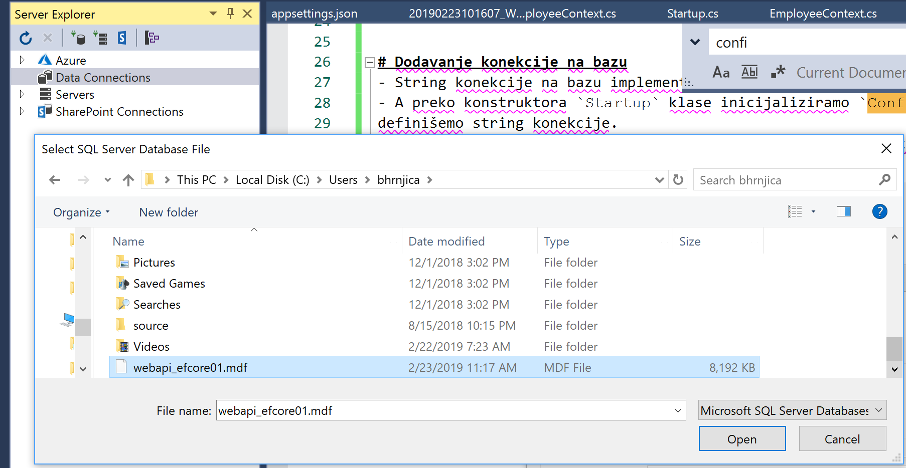
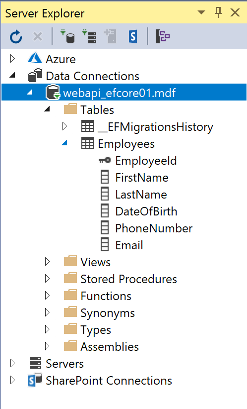

# Implementacija Entity Framemwork Core u Web API

Primjer predstavlja implementaciju EF Core u Web API-u. EF Core predstavlja developerski alat za rad sa bazom podataka.
Da bi se uspješno implemntirala podrška a EF Core potrebno je EF Core kompnente registrovati preko Dependancy Injection patterna.

Primjer se sastoji u implementaciji Code - First strategije. To znači da se prvo generiraju .NET klase a zatim migriraju podaci u bazu podataka.

U primjeru korištena je klasa `Employee`, koja predstavlja jednu tabelu u bazi podataka. 
Pored Employee generirana je klasa `EmployeeContext` za manipulaciju sa bazom. Zatim je implementiran Data Acces Layer (DAL) 
koji omogućava da posedno koristimo pristup bazi podataka iz kontrolera. Kada smo implementirali DAL tada implementiramo 
kontroler sa pripadajućim akcijama. 

## Koraci u implementaciji EF u Web API

1. Generirati prazan Asp.NET Core Web API projekat. (Vidi prethodne primjere)
2. Dodati podršku za MVC i EF te instalirati pripadajuće NuGet pakete
3. Implementirati klase `Employee` i `EmployeeContext`
4. Implementirati konekciju na bazu u Web API
4. Dodati `appsettings.json` konfiguracijsku datoteku i definisati string konekcije
4. Izvršiti migraciju i generirati bazu podataka
5. Implementirati DAL
6. Implementirati Kontroler 
7. Testirati aplikaciju

# Dodavanje konekcije na bazu
- String konekcije na bazu implementiramo tako što u `Startup` klasi implementiramo property `StringConnection` 
- A preko konstruktora `Startup` klase inicijaliziramo `Configuration` property. U projekat doajemo `appsettings.json` datoteku u kojoj 
definišemo string konekcije.
- Stringu konekcije pristupamao preko `Configuration` može koristiti bilo gdje u apliaciji. Na ovaj način smo definisali string konekcije samo na jednom mjestu.
- U `ConfugreServices` definišemo `EmplyeeContex` sa definisanim stringom konekcije, prije definisanje MVC podrške.

# Migracija i generiranje baze podataka
- S obzirom da naša baz jos ne postoji potrebno ju je generirati iz koda kojeg smo do sada napisali. 
- U Nuget konzoli izvrsimo sljedeću komandu:
 `PM> Add-Migration WebAPI_EFCore.Models.EmployeeContext` to ce nam generirati klase za migraciju.
- Kada se generiranje koda zavrsilo uspjesno, pokrenimo komandu 
`PM> update-database`
- Datoteka baze podataka se nalazi na defultnoj lokaciji koja je cesto `c:\users\[username]`,
- Pomocu VS Server Explorer otvoriti bazu i pregledati tabele

# Dodavanja početnih podataka u bazu, modifikacija baze, revert migration

- Potrebno je unijeti inicijalne podatke da bi nastavili sa razvojem aplikacije.
- Migraciju možemo raditi svaki put kad se promjeni nesto u bazi  
- Podatke sa migracijom možemo unijeti u bazu kada preklopimo metodu OnModelCreating od `DbContexta`
- U Nuget konzoli izvrsimo sljedeću komandu:
 `PM> Add-Migration WebAPI_EFCore.Models.EmployeeContext_01` to ce nam generirati klase za migraciju.
- Kada se generiranje kod zavrsilo uspjesno, pokrenimo komandu 
`PM> update-database`

Svaki put kada se izvrsi migracija ona se pohrani u folder migration, 
zato je dobra praksa da se svakoj migraciji daje smisleno ime da se se migracije mogle pratiti.

- Ako zelimo stanje vatiti prije migracije pozvat cemo 
 `PM> remove-migration`

 

# Imlementacija pristupa podacima (DAL)
- Nije dobra praksa da se pristup bazi i izvrsavanja komandi prema bazi radi iz kontrolera. 
- Za to je dobro radit novi layer  kojeg ce kontroler pozivati, te posredno pristupati bazi.
- Na pocetku je potrebno implementirati interfejs `IDataRepository` koji ce biti basni tip za svaki DAL klasu. 
- Interfejs sadzi 5 metoda koje svaka izvedena klasa mora implementirati. (`GetAll`, `Get`, `Add`, `Update`, i `Delete`) a koje odgovaraju koresponedtnim HTTP zahtjevima.
- Zatim imlementirati klasu `EmployeeManager` za manipulaciju Employee podataka između baze i Web APIa.
- Dodati repozitory `EmployeeManager` korištenjem `Dependancy Innjection` u startup klasu Web APIa- 
- Repository dodajemo poslije dodavanja DbCOntexta a prije MVC podrske.
- `services.AddScoped<IDataRepository<Employee>, EmployeeManager>();`
- Na kraju implementirati kontolrer `EmployeeController`
- Testirati palikaciju koristenjem Postman alata