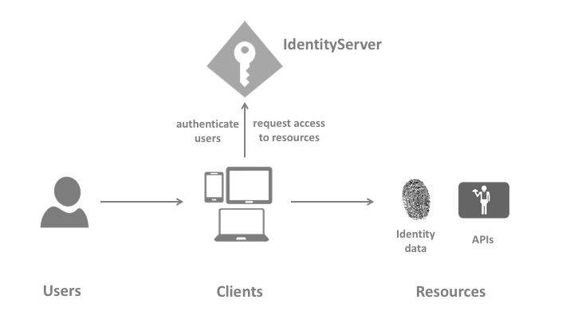

# Implementacija Token Bazirane Zaštite Web API-a
(https://identityserver4.readthedocs.io/)
U ovom demo primjeru implementirana je Token bazirana zaštita koja je bazirana na IdentityServeru.
IdentityServer4 je OpenID i OAuth 2.0 framework za Asp.NET Core aplikacije.
Pomoću IdentityServer4 u stanju smo implementirati kompleksu zaštitu naših Web API servisa koristeći nekoliko strategija zaštite koje se baziraju ili na OpenID ili OAuth 2.0 tehnologiji.
IdentityServer4 sadrži:
- Authentication as Service - centraliziranu logiku za logiranje za web, nativne, mobile ili servicne aplikacije.
- Single Sihn-on/Sihn-out - jednostavnu ne ponavljajuću  prijavu (odjavu) sa višetipnim aplikacijama.
- Kontrola pristupa za API-e - sa IdentityServer4 u mogućnosti smo realizirati svaki scenario zaštite-
- Federation Gateway - podrđka za vanjske identity provajdere poput AAD, Google, Facebook, itd. 

# Identity Server Architecture Diagram

Arhitektura IdentityServera prikazana je na donjoj slici:

Komunikacija koja se ostvaruje između klijenta i servisa:
1. Internet Browser šalje zahtjev prema Web Aplikaciji
2. Web Aplikacija komunicira sa Web API
3. Browser bazirane aplikacije komuniciraju sa APIem
4. Server bazirane aplikacija komuniciraju sa API
5. Web API komunicira sa API

Često svaki sloj aplikacije  (front-end, middleware, back-end) mora biti zaštićen i propisan način pistupanju resursa u sloju.
Ukoliko želimo ostvariti da n-tier (višeslojne) aplikacije imaju standardiziranu zaštitu moramo obezbjediti token bazirni koncept zaštite.
Sljedeća slika daje slikovit prikaz zaštite bazirane na tokenu:

Prikazana zaštita dijeli koncept zaštite na dva dijela:

## Autentifikacija 
Autentifikacija je potrebna kad aplikacija mora znati identitet korisnika. Obično takve apliakcije baziraju svoje informacije na osnovu korisnika koji pristupa istim.
Najčešći primjer ovakve vrste zaštite je web aplikacije.
Najčešći autentifikacijski protokol jeste SAML2p, WS-Fedeeration i OpenID COnnect. Prvi koncept je najčešći.
OpenID COnnect predstavlja novi koncept u odnosu na prethodne i predstavlja vrlo potencijalni koncept za nove i buduće aplikacije.

## API Pristup 
Apliakcije imaju dva načina na koji komuniciraju sa API: 
- koristeći aplikacijski identite
- predstavljajući korisnikon identitet

POnekad oba koncepta su poželjna.
OAuth2 je protokol koji podrazumijeva pristup preko tokena koji se generiše preko servisa za izradu zaštitnih tokena. Jednom kada se generise token za pristup nam služi za pristupanje svim resursima s kojim je definisan.
Ovakav princip reducira kompleksnost kako kod klijentske tako i servisne strane, jer se autentifikacija i autorizacija mogu drstično pojednostaviti.

## OpenID Conncet i OAuth2
Ova dva koncepta su slična, u stvari OpenID COnncet je proširtenje OAuth2.0. Dva osnovna problema: autentifikacije i pristupa APIu se kombinuju u jedna protokol često puta sa jednim tokenom.
## Identity Server 4

IdentityServer4 u stvari predstavlja middleware koji obezbjeđuje OpenID Connect i OAuth2.0 u bilo kojoj ASP.NET Core aplikaciji.
Često ASP.NET aplikacija sadrži login stranicu za prijavu i odjavu pri čemu IdentityServer4 obezbjeđuje middleware arhitekturu za komunikaciju izmedju klijenta i servisa.
Na narednoj slici vidimo koncept IdentityServira4. 

U stvari preko našoj apliakciji korisnik prosljedjuje zahtejv za prijavu i odjavu, dok IdentityServer prima zahtjeve za autorizaciju, token, discovery i dr.

# Implementacija jednostavne zaštite preko tokena
Ovaj primjer sastoji se od implementacije tri projekta:
1. IdentityServer - ASP.NET Core apliakcija za generiranje tokena za zaštitu
2. Web API - ASP.NET Core aplikacije za implementaciju našeg WebAPI servisa
3. Klijent -.NET Core apliakcija koja pravi zahtjev za token prema IdentityServeru, a zatim pristupa WebPI preko generiranog tokena.

# 1. Implementacija IdentityServera
- Generirati jednostavnu ASP.NET Core Web APliakciju
- Dodati IdentityServer4 nuget paket
- Implementirati metode iz Startup klase
- za generiranje tokena koristiti ``.well-known/openid-configuration putanju``

# 2. Implementacije Web API 
- Generirati jednostavnu ASP.NET Core Web APliakciju
- Dodati IdentityServer4 nuget paket
- Configurirati Bearer token i Authentifikaciju preko IdentityServera
- Implementirati IdentityControler za testiranje tokena
- Dekorirati kontroler sa [Authorize]

# 3 Implementirati klijenta za pristup Web API sa tokenom
- Generirati jednostavni .NET COre Console apliakciju
- Dodati kod za generiranje tokena a zatim napraviti zahtjev prema Web API uključujući generirani token.

Ova implementacija ne zahtjeva nikakav username i pasword.