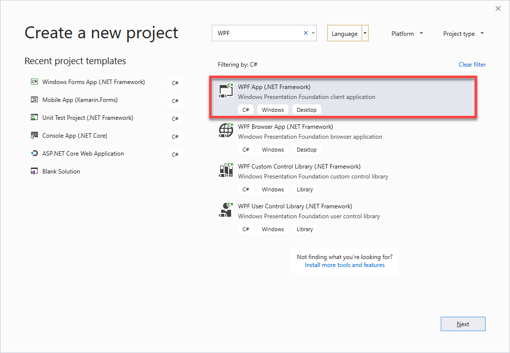

WPF Windows klijent
=======================================
U ovom predavanju prikazane su neke od najzastupljenijih platformi za razvoj Window Desktop aplikacija:
- WinForms
- WPF

# WinForms primjeri
1. Prvi primjer demonstrira upotrebu WinForms frameworka ra razvoj Desktop apliakcija. Posebno u prvom projektu prikazan je primjer korisštenja ErrorProvider komponente u WinForms koja nam omogućava validaciju podataka u WinFormi.

2. Primjer prikazuje MVC softversku tehniku koja se najčešće koristi kod WinForms frameworka. 

Oba primjera formiraju se pomoću Visual Studio alata za generiranje koda, preko ``File->New Project-> WinForms Application by C#``

#WPF Primjer
3. WPF klijent
Primjer demonstrira upotrebu WPF (Windows Presentation Foundation) platforme za razvoj Windows Desktop Aplikacija.

Demo primjer prikazuje nekoliko ključnih tehnologija koje WPF posjeduje:

- ``DataBinding`` - nacin povezivanja podataka sa UI kontrolama
- ``DataTemplate`` - tehnologiju koristenja databinding u dizajniranju kontrola i podataka.
- ``MVVM Pattern`` - najčešći softverski pristup kod implementacije bussines aplikacija u WPF. 

Aplikacija se formira preko Visual Studio 2019 i formiranje novog WPF projekta.

Nakon formiranje novog projekta potrebno je implementirati MVVM patern kroz implementaciju:

1. ToDoStavka.cs  - koja predstavlja model
2. ToDoLista.xam - koja predstavlja View
3. Presenter.cs - koja predstavlja ViewModel - i zaduzena je ua komunikaciju sa UI i modelom, 
4 Implementacija Commandi odnosno UI events.