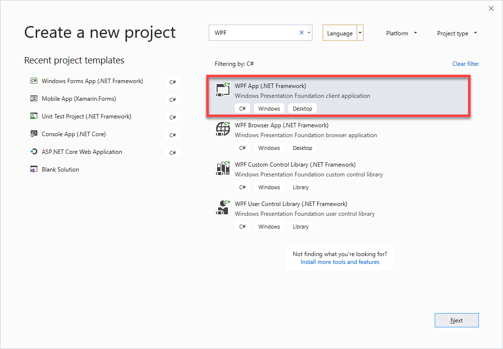

WPF Windows klijent
=======================================
U ovom predavanju prikazane su neke od najzastupljenijih platformi za razvoj Window Desktop aplikacija:
- WinForms
- WPF

# WinForms primjeri
1. Prvi primjer demonstrira upotrebu WinForms frameworka ra razvoj Desktop apliakcija. Posebno u prvom projektu prikazan je primjer korisštenja ErrorProvider komponente u WinForms koja nam omogućava validaciju podataka u WinFormi.

2. Primjer prikazuje MVC softversku tehniku koja se najčešće koristi kod WinForms frameworka. 

Oba primjera formiraju se pomoću Visual Studio alata za generiranje koda, preko ``File->New Project-> WinForms Application by C#``

# WPF Primjeri

3. **DataBindingDemo**
Primjer demonstrira upotrebu WPF (Windows Presentation Foundation) platforme za razvoj Windows Desktop Aplikacija.

Demo primjer prikazuje nekoliko ključnih tehnologija koje WPF posjeduje:

- ``DataBinding`` - način povezivanja podataka sa UI kontrolama
- ``DataTemplate`` - tehnologiju korištenja databinding u dizajniranju kontrola i podataka.
- ``MVVM Pattern`` - najčešći softverski pristup kod implementacije bussines aplikacija u WPF. 

Aplikacija se formira preko Visual Studio 2019 i formiranje novog WPF projekta.

Nakon formiranje novog projekta potrebno je implementirati MVVM patern kroz implementaciju:

1. ToDoStavka.cs  - koja predstavlja model
2. ToDoLista.xam - koja predstavlja View
3. ToDoViewModel.cs - koja predstavlja ViewModel - i zaduzena je ua komunikaciju sa UI i modelom, 

4. **Implementacija Master-Detail Scenario u WPF korištenjem XmlDataProvider**

Demo prikazuje primjer korištenja Master-Details koncepta pri prikazu tri
sihhronizirane ListBox kontrole za prikaz XML podataka. Podaci su hiearhijski
koncipirani, i kao takvi se prikazuju na WPF UI. Značajno je kazati da se cijeli postipak povezivanja list box kontrola i podataka u xml datoteci implementirao u xaml datoteci.

Primjer je preuzet sa oficijelne Micforosot stranice za WPF i tamo se mogu naći
više informacija i primjera za korištenje WPF:
<https://github.com/microsoft/WPF-Samples>

