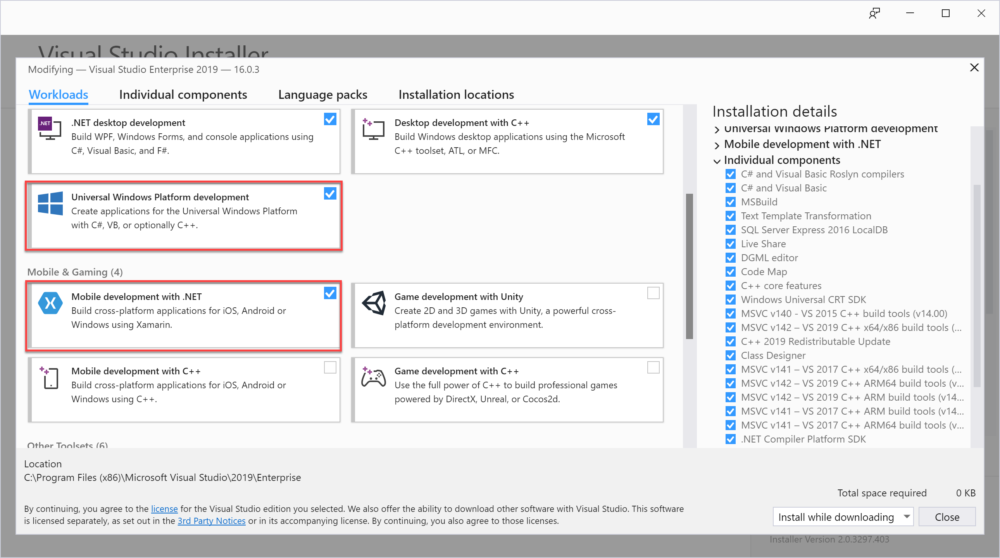
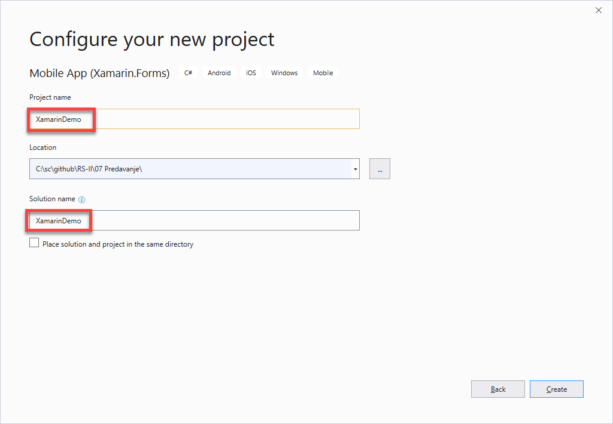
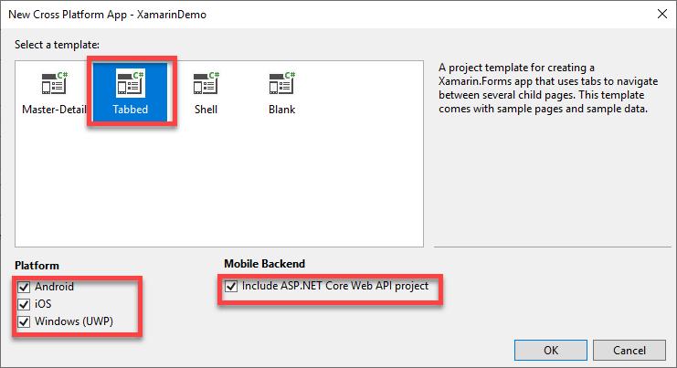
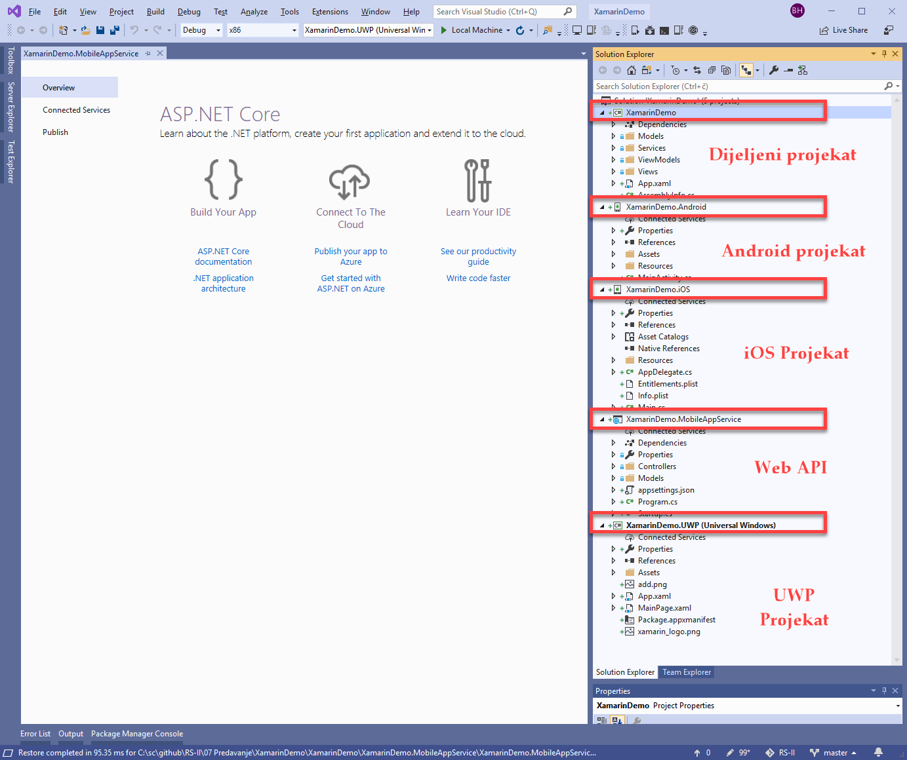
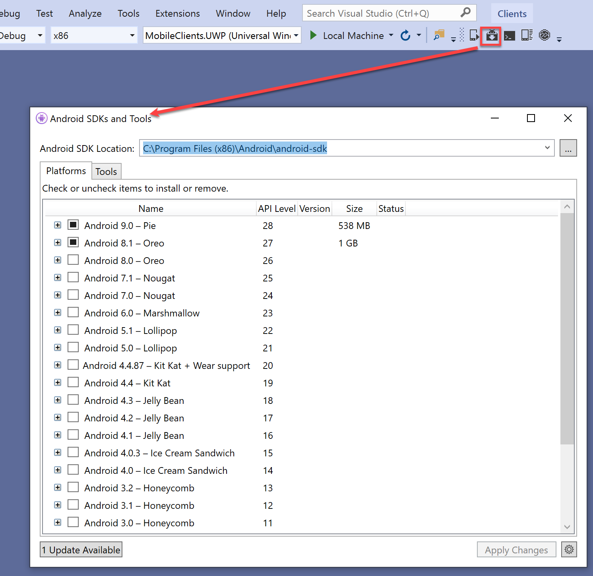
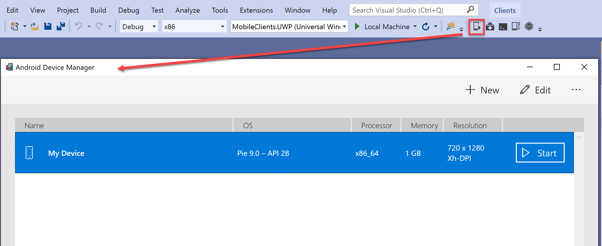
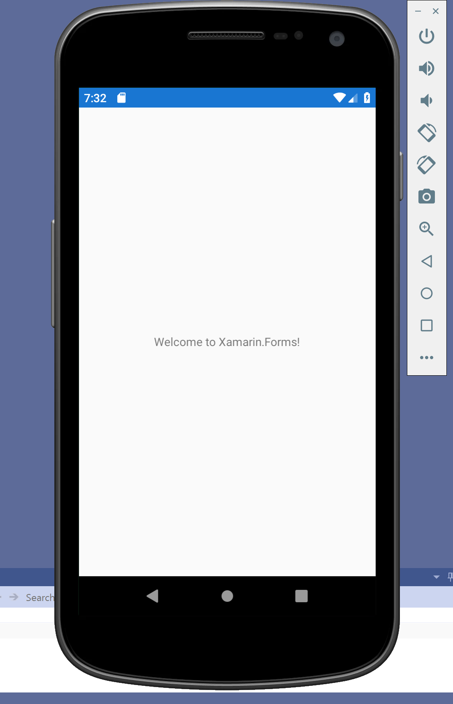
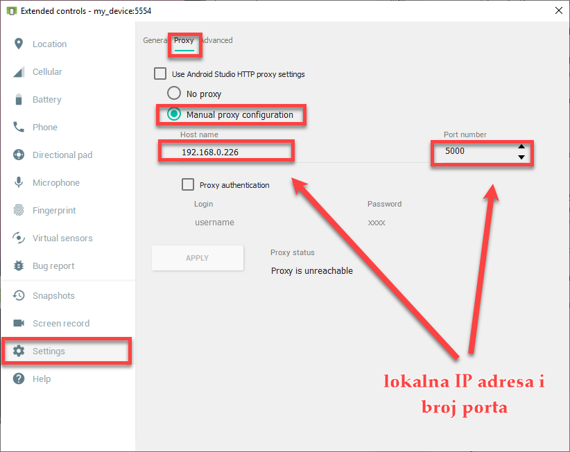
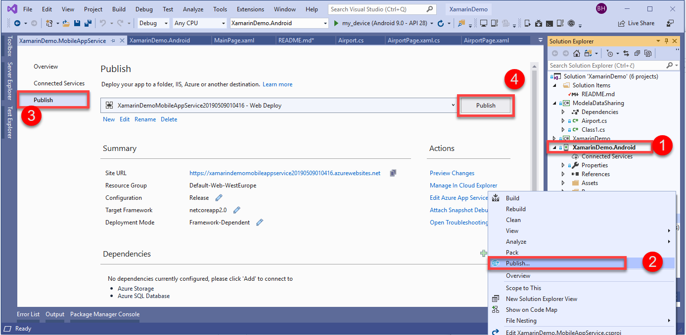
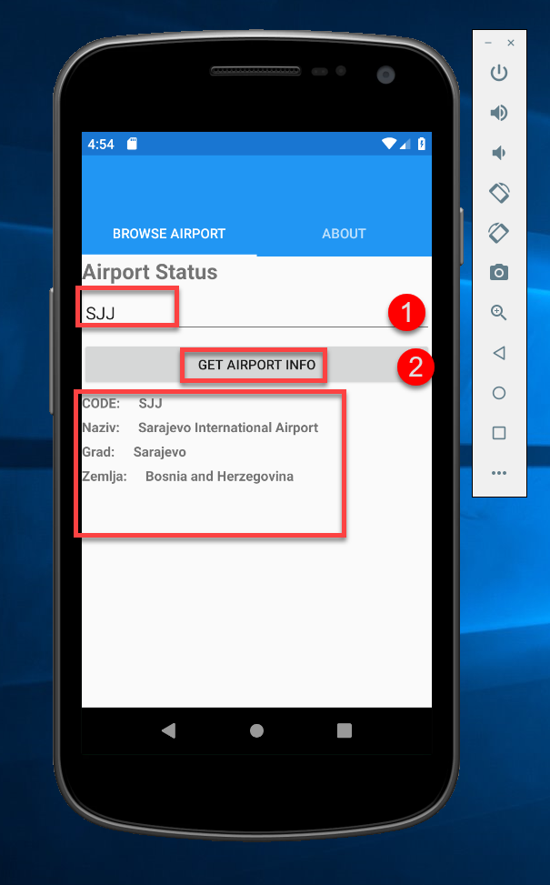

# Klijenti

U ovom predavanju navest ćemo neke od najviše korištenih klijenata, koji konzumiraju Web Serivse. Kao prvo danas najznačajniji klijenti predstavljaju mobilne aplikacije, koje se vrte na Android i IOS uređajima. U ovoj vjezbi demonstrirat ćemo kako koristiti Xamarin platformu za razvoj mobilnih aplikacija za Android. 

## Instalacija komponenti i formiranje startnog projekta

Da bi razvijali Xamarin ili iOS ili UWP bazirane aplikacije potrebno je instalirati module Xamarin i UWP. Donja slika pokazuje koje Workloads se trebaju instalirati da bi mogli razvijati Xamarin i UWP aplikacije. 


1. Sada kada imamo instalirane komponente za razvoj krenimo formirati novi projekat, i izaberimo Xamarin Mobile APP



2. Klikom na ``Next`` dugme prelazimo u novi dijalog gdje trebamo izabrati koje platforme đelimo u svom rješenju:

Izaberimo Master-Detail ili Tabbed šablon (template), te zakačimo Android, (iOS) i UWP platforme te zajednički Asp.NET Web API servis.
3. Kada odaberemo ``Next`` dugme pojavljuje se 5 odnosno 6 ako smo odabrali iSO projekata u nutar VS 2019:
- Dijeljeni projekat baziran .NET Standard 2.0 koji je zajednički za svaki projekat (Android odnono UWP odnosno iOS)
- Android Projekat za razvoj Adroid aplikacije
- iOS projekat za razvoj iOS aplikacija  
- UWP projekat za razvoj UWP aplikacije, i 
- Asp.NET Web API Projekat.
 
4. Prije nego započnemo proces implementacije potrebno je instalirati u formirati emulator za Android uredjaj. Preko opcije ``Android SDK Manager`` moguće je instalirati potrebne Android SDK biblioteke:
 
5. Zatim je potrebno instalirati barem jedan Android emulator za estiranje i debugiranje Android aplikacije.
 
6. Kada formira emulator, moguće ga je pokrenuti:
  
Primjer koji je implementiran u ovom dijelu prikazuje kako koristiti ``HttpClient`` unutar Xamarina da saljemo zahtjeve za nas WebAPI. U tom pogledu formirat ćemo novi .NET Standard biblioteku u kojoj ćemo definisati na zajednički model kojeg će koristiti i Xamarin bazirane aplikacije i WebAPI i nazvati ga ``ModelDataSharing``. Unutar ovog projekta implementirat ćemo klasu ``Airport``:

```
public class Airport
    {
        public string AirportID { get; set; }
        public string Name { get; set; }
        public string City { get; set; }
        public string Countrey { get; set; }
        public string IATA { get; set; }
        public string ICAO { get; set; }
        public string Latitude { get; set; }
        public string Longitude { get; set; }
        public string Altitude { get; set; }
        public string TimeZone { get; set; }
        public string DST { get; set; }
        public string Tzdbtimezone { get; set; }
        public string Type { get; set; }
        public string Source { get; set; }
    }
```
Dati projekat referencirat ćemo i na WebAPI i na XamarinDemo projekte, s obirom da će ga oba projekta koristiti. Ovim projektom samo na jednom mjestu deklarišemo naš tipove modela koje ćemo koristiti u svim Xamarin projektima i Web API Projektu. 

Sada jos ostaje da se implementira Xamarin dio u kojem se poziva Web API projekat. 
1. Formirajmo novu AirportPage stranicu u kojoj implementiramo jednostavan UI koji se sastoji od:
```
<?xml version="1.0" encoding="utf-8" ?>
<ContentPage xmlns="http://xamarin.com/schemas/2014/forms"
             xmlns:x="http://schemas.microsoft.com/winfx/2009/xaml"
             x:Class="XamarinDemo.Views.AirportPage" BindingContext="{}">


    <StackLayout>
        <Label Text="Airport Status" FontSize="Large" FontAttributes="Bold" />
        <Entry x:Name="airportCode" Placeholder="airport code" Text="SJJ" />
        <Button x:Name="airportButton" Text="Get Airport Info" />

         
        <StackLayout Orientation="Vertical" HeightRequest="500" >
            <StackLayout Orientation="Horizontal">
                <Label Text="CODE: "  FontAttributes="Bold" />
                <Label Text=" "  FontAttributes="Bold" />
                <Label Text="{Binding IATA}"  FontAttributes="Bold" />
            </StackLayout>
            <StackLayout Orientation="Horizontal">
                <Label Text="Naziv: "  FontAttributes="Bold" />
                <Label Text=" "  FontAttributes="Bold" />
                <Label Text="{Binding Name}"  FontAttributes="Bold" />
            </StackLayout>
            <StackLayout Orientation="Horizontal">
                <Label Text="Grad: "  FontAttributes="Bold" />
                <Label Text=" "  FontAttributes="Bold" />
                <Label Text="{Binding City}"  FontAttributes="Bold" />
            </StackLayout>
            <StackLayout Orientation="Horizontal">
                <Label Text="Zemlja: "  FontAttributes="Bold" />
                <Label Text=" "  FontAttributes="Bold" />
                <Label Text="{Binding Countrey}"  FontAttributes="Bold" />
            </StackLayout>
        </StackLayout>
    </StackLayout>
</ContentPage>
```
Sada predjimo u Code-Behind datoteku i implementirajmo Button click event i pomoćnu metodu za poziv našeg Web API. Implementiraciju koju trebamo napisati predstavlja:
```
public AirportPage()
{
    InitializeComponent();
    //set binding context to Airport data type
    this.BindingContext = new Airport();

    airportButton.Clicked += async (s, e) =>
    {
        var code = airportCode.Text;
        var result = await GetAirportAsync(code);
             
        this.BindingContext = result;
    };
}

public async Task<Airport> GetAirportAsync(string code)
{

    var client = new System.Net.Http.HttpClient();
    client.DefaultRequestHeaders.Add("Accept", "application/json");
    var address = $"https://xamarindemomobileappservice20190509010416.azurewebsites.net/api/airport/{code}";

    var response = await client.GetAsync(address);

    var airportJson = response.Content.ReadAsStringAsync().Result;

    var result = JsonConvert.DeserializeObject<Airport>(airportJson) as Airport;

    return result;

}
```

Iz gornjeg listing uočavamo da adresa Web API nije standardna ``localhost:portnum/api/airport/sjj``, nego adresa web API koje smo publicirali u cloudu. Da bi koristili lokalni Web Servis u Androif Emulatoru potrebno je podesiti proxy unutar emulatora. Primjer kako se podešava Android emulator da može poslati zahtjev prema lokalno pokrenutom Web servisu unutar Visual Studia prikazan je na slici. IP adresa i port treba da odgovara IP adresi i portu vašem PC-a.
 

Ukoliko zbog konfiguracije mreže, nije moguće podesiti emulator da pristupi Web servisu, onda je najbolje da se publicira na neki javno dostupnu adresu. 

U ovom slučaju je to azurewebsites.net cloud servis. Publikacija Web servisa na cloud radimo tako što deskim klikom odaberamo ``Publish``, te slijedimo intrukcije.

 

Da bi se AirportPage pojavila kao početna stranica nase Xamarin apliakcije, potebno je uraditi određene izmjene u ``MainPage.xam`` datoteci:
```
<?xml version="1.0" encoding="utf-8" ?>
<TabbedPage xmlns="http://xamarin.com/schemas/2014/forms"
            xmlns:x="http://schemas.microsoft.com/winfx/2009/xaml"
            xmlns:views="clr-namespace:XamarinDemo.Views"
            x:Class="XamarinDemo.Views.MainPage">

    <TabbedPage.Children>
        <NavigationPage Title="Browse Airport">
            <NavigationPage.Icon>
                <OnPlatform x:TypeArguments="FileImageSource">
                    <On Platform="iOS" Value="tab_feed.png"/>
                </OnPlatform>
            </NavigationPage.Icon>
            <x:Arguments>
                 <views:AirportPage />   
            </x:Arguments>
        </NavigationPage>
        
        <NavigationPage Title="About">
            <NavigationPage.Icon>
                <OnPlatform x:TypeArguments="FileImageSource">
                    <On Platform="iOS" Value="tab_about.png"/>
                </OnPlatform>
            </NavigationPage.Icon>
            <x:Arguments>
                <views:AboutPage />
            </x:Arguments>
        </NavigationPage>
    </TabbedPage.Children>
    
</TabbedPage>
```

- Na kraju je još potrebno provjeriti da li naša apliakcija ima dozvolu da `pristupa` internetskim stranicama:
- POkrenumo Android projekat, tako što ćemo ga proglasiti ``Start up project`` i pritisniti tipku ``F5``. Rezultat implementacije treba da izgleda slično kao:
 